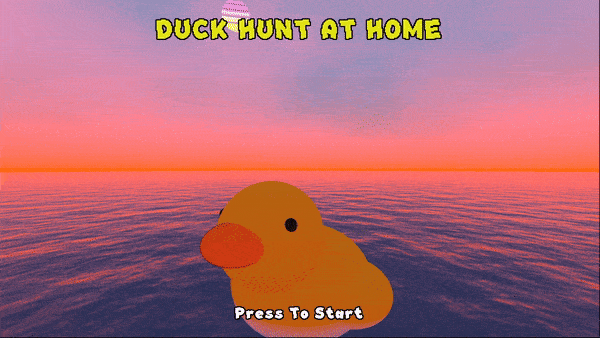
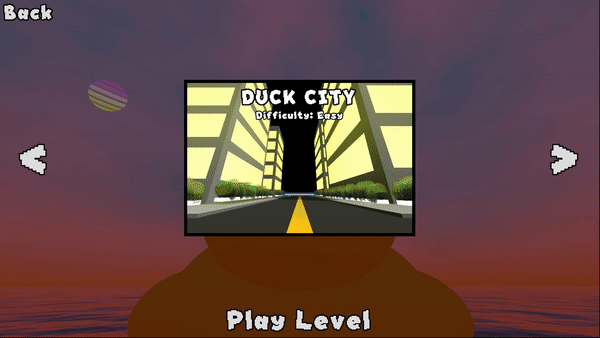
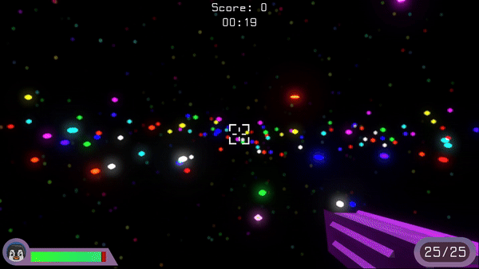

# Duck-Hunt-At-Home

## Preview

**Main Menu**

**Level Select**

**Duck City (Easy)**

**Misty Plains (Medium)**

**Neon Space (Hard)**

## Download Link
**Note: The game was developed for Windows devices.**

If you're interested in trying out the game, you can download the game on my google drive found [here.](https://drive.google.com/drive/folders/1vU743ztD9bp60dmozVNLUnb5N9uOsH7m?usp=sharing)

## About
*Dunk Hunt At Home* is an fps survival game where you are constantly chased by ducks, and you must eliminate as many ducks as possible to accumulate score. I created this game to learn Godot in a 3D context while also learning what goes into creating one of my most played genre of games.

## Controls
W: Move Forward

A: Move Left

S: Move Backwards

D: Move Right

Space: Jump

Left Click: Shoot

Right Click: Grapple

R: Reload

Esc: Open Pause Menu

## Tools Used
- Godot Version 4.2.2
- Aseprite Version 1.3.7-x64

## Assets

**Fonts**
- *FS A Pixel Away* by moontr3 [(Source)](https://fontesk.com/fs-a-pixel-away-font/)
- *Touchscreen* by SED4906 [(Source)](https://fontesk.com/touchscreen-font/)

**Meshes**
- Bush.obj by J Hell [(Source)](https://github.com/h3lly3r/Stylized-tee-shader-solutions)
- GrassMesh.res by Malido [(Source)](https://github.com/Malidos/Grass-Shader-Example)

**Shaders**
- Barrier by Dan [(Source)](https://godotshaders.com/shader/energy-shield-with-impact-effect/)
- Bubble by thelastflapjack [(Source)](https://godotshaders.com/shader/distortion-bubble/)
- Bush by J Hell [(Source)](https://godotshaders.com/shader/simple-cheap-stylized-tree-shader/)
- CircleFrame created by me
- Grass by Malido [(Source)](https://godotshaders.com/shader/stylized-multimesh-grass-shader/)
- Space by breadpack [(Source)](https://godotshaders.com/shader/starry-sky/)
- Sun by Modern Malick [(Source)](https://godotshaders.com/shader/retro-sun/)
- Water by Andrei Neacsu [(Source)](https://godotshaders.com/shader/another-water-shader/)

**Textures**
- FoliageTexture.png by J Hell [(Source)](https://github.com/h3lly3r/Stylized-tee-shader-solutions)
- LeavesTexture.jpg [(Source)](https://www.freepik.com/premium-ai-image/seamless-leaf-texture-background_65401184.htm)
- LogTexture.webp [(Source)](https://flexbark.com/bark-textures/)
- MuzzleFlashTexture.png [(Source)](https://www.filterforge.com/filters/12613.html)
- RainTexture.png by mmbwatt [(Source)](https://github.com/mmbwatt/Particle_Rain_FX)
- SoilTexture.jpg [(Source)](https://architextures.org/textures/1997)

**Images**
- All images in the Images folder outside of the Textures folder were either drawn by me using *Aseprite*, or in-game screenshots.

**Sound Effects**
- Bubble Pop SFX: Pop SFX [(Source)](https://www.myinstants.com/en/instant/pop-sfx-75405/)
- Click SFX: Nintendo Switch Click Sound
- Enemy Ambience 1 SFX: *MacOS* - Macintosh Quack Sound
- Enemy Ambience 2 SFX: Duck [(Source)](https://www.myinstants.com/en/instant/duck/)
- Enemy Ambience 3 SFX: *Terraria* - Duck Sound Easter Egg
- Enemy Ambience 4 SFX: [(Source)](https://www.myinstants.com/en/instant/quack-reverb-80246/)
- Enemy Charge SFX: Donald Drug [(Source)](https://www.myinstants.com/en/instant/donald-drug-1660/)
- Enemy Damage SFX: *Super Smash Bros.* - Yoshi Damaged Sound
- Enemy Died SFX: *Duck Hunt* - Got Duck(s) Sound
- Enemy Shoot SFX: *Pokémon* - Generation 3 Bubble Beam Sound
- Grapple Hook SFX: *Minecraft* - Bow Shooting Sound Effect
- Player Damage SFX: Duck Toy Sound [(Source)](https://www.myinstants.com/en/instant/duck-toy-sound-18073/)
- Player Death SFX: *Metal Gear Solid (1998)* - Snake Death Scream
- Player Empty Mag SFX: *Minecraft* - Button Click Sound
- Player Reload SFX: Shotgun Reload [(Source)](https://www.myinstants.com/en/instant/shotgun-reload-23461/)
- Player Shot Hit SFX: hitmarker.mp3 [(Source)](https://www.myinstants.com/en/instant/hitmarkermp3/)
- Rain SFX: Light Rain by Liecio [(Source)](https://pixabay.com/sound-effects/search/rain/)
- Shoot SFX: Pistol-Shot [(Source)](https://www.myinstants.com/en/instant/pistol-shot-83692/)

**Music**
- City In Game Music: *Pokémon Diamond, Pearl, Platinum (2006, 2008)* - Game Corner by Go Ichinose
- Game Over Jingle: *Pokémon Pinball: Ruby & Sapphire (2003)* - End of Ball
- Game Over Music: *Pokémon Mystery Dungeon: Explorers of Sky (2009)* - Goodnight by Arata Iiyoshi, Hideki Sakamoto, Keisuke Ito, Ryoma Nakamura, and Ken-ichi Saito
- Menu Music: Itty Bitty 8 Bit by Kevin MacLeod
- Plains In Game Music: *Pokémon HeartGold and SoulSilver (2009)* - S.S. Aqua by Go Ichinose, Takuto Kitsuta
- Space In Game Music: *Sonic Adventure (1998)* - Twinkle Cart ...for Twinkle Park by Fumie Kumatani, Jun Senoue, Kenichi Tokoi, Masaru Setsumaru

**Models**
- All models under the model folder were created by me
